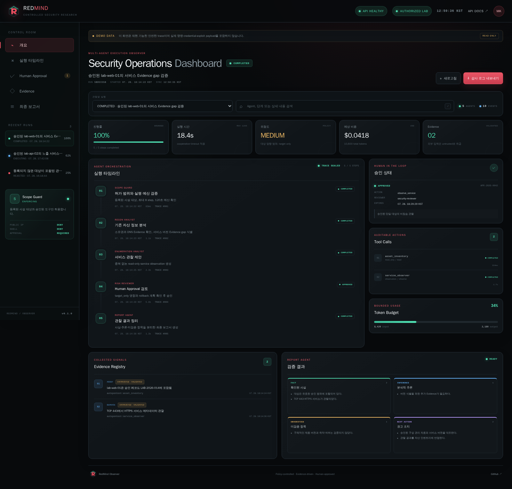
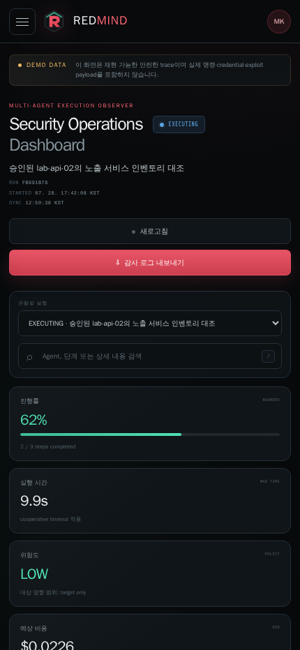
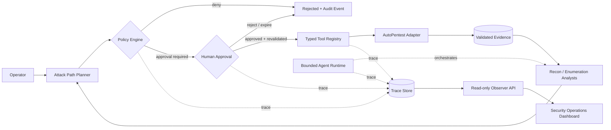

<p align="center">
  
</p>

<h1 align="center">RedMind</h1>

<p align="center">
  <strong>Policy-controlled Multi-Agent Security Research Platform</strong><br>
  허가된 보안 실습 환경에서 Evidence를 분석하고, 검증 가능한 다음 단계를 안전하게 계획합니다.
</p>

<p align="center">
  <a href="https://github.com/MintKangaroo/RedMind/actions/workflows/ci.yml">
    
  </a>
  
  
  
  
  <a href="./LICENSE">
    
  </a>
</p>

<p align="center">
  <a href="#-빠른-시작">빠른 시작</a> ·
  <a href="#-핵심-기능">핵심 기능</a> ·
  <a href="#-아키텍처">아키텍처</a> ·
  <a href="#-api">API</a> ·
  <a href="#-안전-경계">안전 경계</a>
</p>

---

## 실행 관찰 대시보드

RedMind Observer는 실행 상태를 변경하지 않는 **read-only control room**입니다. 여러
실행 전환, Agent 단계 검색, 승인 이력, Tool Call, Evidence, token/cost, 실패 원인과
최종 보고서를 한 화면에서 확인할 수 있습니다.



<details>
  <summary><strong>모바일 대시보드 보기</strong></summary>
  <p align="center">
    
  </p>
</details>

대시보드에서 제공하는 기능:

- 완료·실행 중·정책 거부 trace 전환과 상태별 시각화
- Agent 이름, 단계 제목, 상세 설명의 실시간 검색 (`/` 단축키)
- Human Approval snapshot과 승인자·사유·만료 시각 표시
- Tool Call permission, outcome, 실행 시간 감사
- 외부 Evidence의 `UNTRUSTED · VALIDATED` trust boundary 표시
- token budget, 예상 비용, 실행 시간 및 진행률 관찰
- 현재 trace의 감사 로그 JSON 내보내기
- 데스크톱·태블릿·모바일 반응형 레이아웃

> 기본 화면은 안전한 deterministic demo trace를 사용합니다. 실제 명령, credential,
> exploit payload 또는 공인 대상 정보는 포함하지 않습니다.

## 빠른 시작

### 1. 설치

```bash
git clone https://github.com/MintKangaroo/RedMind.git
cd RedMind

python3.12 -m venv .venv
source .venv/bin/activate
python -m pip install -e ".[dev]"
```

### 2. 대시보드 실행

```bash
uvicorn redmind.web.app:app --reload
```

브라우저에서 아래 주소를 엽니다.

- Dashboard: <http://127.0.0.1:8000>
- OpenAPI: <http://127.0.0.1:8000/api/docs>
- Health: <http://127.0.0.1:8000/health/live>

### 3. 품질 검사

```bash
make check
```

`make check`는 Ruff lint/format, strict mypy, 전체 pytest와 100% coverage gate를
순서대로 실행합니다.

## 핵심 기능

| 영역 | 구현 내용 | 안전 장치 |
|---|---|---|
| Agent Runtime | 명시적 상태 머신, bounded async loop, cancellation, timeout | 최대 step·시간 상한 |
| Policy Engine | scope, target, tool, risk, budget 검증 | deny-by-default, 공인 IP 차단 |
| Tool Registry | Pydantic typed input, permission, timeout, audit hook | shell 및 자유 형식 command 차단 |
| Security Analysts | Recon·Enumeration Evidence gap 분석 | 근거 없는 버전 추론 방지 |
| Attack Path Planner | Evidence coverage와 confidence 기반 후보 생성 | 허가 대상·allowlist 도구만 제안 |
| Human Approval | snapshot, 만료, 거부, 재승인, 실행 직전 재검증 | proposal 변경 탐지, append-only audit |
| Reflection | 실패 분류, retry fingerprint, bounded replan | 동일 실패·retry 횟수 상한 |
| AutoPentest Adapter | 자산·Finding·Attack Graph 조회와 observation 요청 | 응답 크기·timeout·schema trust boundary |
| Observer Dashboard | Run/Step/Tool/Evidence/Approval/Usage/Report 통합 관찰 | read-only API, demo trace 명시 |

## 아키텍처

RedMind의 핵심 도메인은 FastAPI나 외부 벤더 SDK에 의존하지 않습니다. 정책과 승인
경계를 통과한 구조화된 제안만 도구 또는 integration adapter에 전달됩니다.



### 실행 흐름

1. Runtime이 허가 범위와 step/time budget을 고정합니다.
2. Analyst가 기존 Evidence의 gap만 구조화된 proposal로 생성합니다.
3. Planner가 Evidence coverage, confidence, 중복 여부를 계산합니다.
4. Policy Engine이 대상·도구·위험도·예산을 검증합니다.
5. 필요한 경우 Human Approval을 받고 실행 직전에 proposal과 policy를 재검증합니다.
6. Typed Tool 또는 AutoPentest adapter 결과를 untrusted input으로 다시 검증합니다.
7. 모든 상태 전환과 결과를 append-only trace로 남기고 Observer가 이를 읽습니다.

자세한 설계는 [Architecture](./docs/architecture.md)와
[Threat Model](./docs/threat-model.md)을 참고하세요.

## API

Observer API는 의도적으로 조회 기능만 제공합니다.

| Method | Endpoint | 설명 |
|---|---|---|
| `GET` | `/health/live` | 프로세스 liveness |
| `GET` | `/api/v1/runs` | 최신순 Run summary 목록 |
| `GET` | `/api/v1/runs/{run_id}` | 전체 실행 timeline |
| `GET` | `/api/docs` | Swagger UI |

```bash
curl -s http://127.0.0.1:8000/api/v1/runs
curl -s http://127.0.0.1:8000/api/v1/runs/5bdece5b-53fd-4a81-b326-cb0894963463
```

응답 모델과 repository 주입 방법은 [API 문서](./docs/api.md)에 정리되어 있습니다.

## 프로젝트 구조

```text
RedMind/
├── src/redmind/
│   ├── runtime/
│   │   ├── engine.py          # bounded async Agent runtime
│   │   ├── state_machine.py   # lifecycle 전이 규칙
│   │   ├── policy.py          # scope/risk/budget 정책
│   │   ├── tools.py           # typed auditable Tool Registry
│   │   ├── analysts.py        # Recon/Enumeration Analyst
│   │   ├── planner.py         # Evidence-driven planner
│   │   ├── approval.py        # Human Approval workflow
│   │   └── reflection.py      # bounded retry/reflection
│   ├── integrations/
│   │   └── autopentest.py     # validated external adapter
│   └── web/
│       ├── app.py             # read-only FastAPI application
│       ├── timeline.py        # dashboard view models/repository
│       └── static/            # responsive dashboard
├── tests/unit/                # deterministic unit tests
├── docs/                      # architecture, API, threat model
└── pyproject.toml
```

## 안전 경계

> [!CAUTION]
> RedMind는 소유자 또는 명시적으로 허가받은 시스템, 로컬/Docker lab, CTF,
> 교육용 cyber range에서만 사용해야 합니다.

다음 행위는 설계 범위에 포함되지 않습니다.

- 공인 인터넷 또는 미등록 대상 탐색
- credential 탈취, persistence 또는 방어 통제 우회
- malware 전달, 파괴적 행위 또는 데이터 유출
- 자유 형식 shell command, exploit payload 생성·실행
- Agent가 scope를 변경하거나 target을 추가하는 행위

외부 응답은 신뢰하지 않으며 Pydantic 검증을 통과한 뒤에만 Evidence로 사용합니다.
자세한 신고 절차와 사용 정책은 [SECURITY.md](./SECURITY.md)를 확인하세요.

## 현재 상태

`v0.1.0` MVP의 1~9단계가 구현되어 있습니다.

- [x] Agent Runtime
- [x] Policy Engine
- [x] Typed Tool Registry
- [x] Recon / Enumeration Analyst
- [x] Evidence-driven Attack Path Planner
- [x] Human Approval
- [x] Bounded Reflection / Retry
- [x] AutoPentest AI Adapter
- [x] Execution Observer Dashboard

다음 마일스톤은 실제 운영 adapter, 영속 trace repository, authentication/RBAC 및
OpenTelemetry 기반 관찰성입니다. 세부 계획은 [Roadmap](./docs/roadmap.md)에 있습니다.

## 개발 참여

변경사항은 typed, tested, documented 상태를 유지해야 합니다.
[CONTRIBUTING.md](./CONTRIBUTING.md)의 브랜치·검사·보안 규칙을 먼저 확인해 주세요.

```bash
ruff check .
ruff format --check .
mypy .
pytest
```

## 라이선스

[MIT License](./LICENSE) © AI Security Lab Contributors
