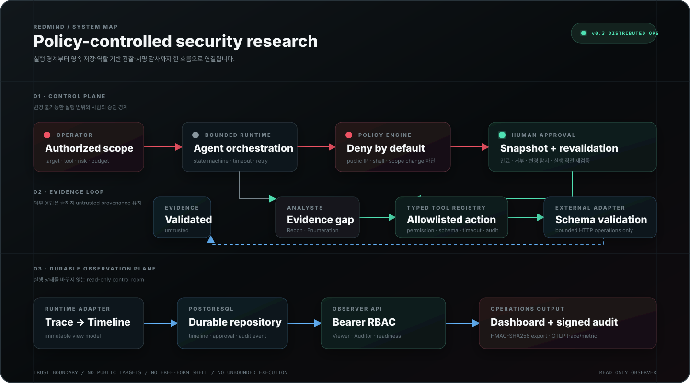

# Architecture

## 개요

RedMind는 허가된 cyber range에서 Evidence를 분석하고 다음 검증 단계를 계획하는
정책 통제형 multi-agent runtime입니다. 핵심 domain은 framework와 분리되어 있으며,
FastAPI와 외부 HTTP는 각각 read-only observer 및 integration boundary에만 존재합니다.

## 구성 요소

| Component | Responsibility |
|---|---|
| `runtime/models.py` | Run, Step, Message, Evidence 및 trace domain model |
| `runtime/engine.py` | step/time budget, cancellation, output validation |
| `runtime/policy.py` | target scope, risk, tool allowlist 및 budget decision |
| `runtime/tools.py` | typed permission, timeout과 audit hook을 가진 Tool Registry |
| `runtime/analysts.py` | Evidence gap 기반 Recon/Enumeration proposal |
| `runtime/planner.py` | coverage와 confidence 기반 attack path candidate |
| `runtime/approval.py` | immutable proposal snapshot과 human approval audit |
| `runtime/reflection.py` | failure fingerprint와 bounded retry/replan |
| `integrations/autopentest.py` | 고정 HTTP operation과 untrusted response validation |
| `web/adapter.py` | immutable runtime trace를 Observer timeline으로 변환 |
| `web/repository.py` | PostgreSQL/SQLite async timeline·approval·audit persistence |
| `web/auth.py` | digest-backed bearer authentication과 Viewer/Auditor RBAC |
| `web/signing.py` | canonical HMAC-SHA256 signed audit export |
| `web/telemetry.py` | credential 비수집 OpenTelemetry HTTP span과 metric |
| `web/` | authenticated read-only FastAPI와 static dashboard |
| `runtime/queue.py` | bounded worker queue와 cooperative cancellation propagation |

## Trust boundary

```text
Operator / Config
       │ validated scope + budget
       ▼
Agent Runtime ──► Analysts ──► Planner
       │                          │
       │ trace                    ▼
       │                    Policy Engine
       │                     │ deny │ approval
       │                     ▼      ▼
       │                 Audit    Human Review
       │                            │ revalidate
       │                            ▼
       └────────────────────► Typed Tool / Adapter
                                    │ untrusted response
                                    ▼
                              Schema Validation
                                    │
                                    ▼
                                Evidence
```

Agent와 외부 API는 신뢰 경계 밖에 있습니다. proposal과 외부 응답은 Pydantic model로
검증되며, 자유 형식 command, payload, exploit, script argument는 차단됩니다.

## Runtime invariants

- scope와 target set은 Run 생성 후 Agent가 변경할 수 없습니다.
- 모든 Run/Step 전이는 명시적 상태 머신 규칙을 따릅니다.
- 실행 시간, step 수, target 수, retry 수와 비용에는 상한이 있습니다.
- high/critical 또는 state-changing proposal은 Human Approval이 필요합니다.
- 승인은 proposal snapshot에 묶이며 실행 직전 현재 policy로 재검증됩니다.
- Tool Call, Approval과 상태 전이는 append-only audit event로 추적합니다.
- 외부 문자열은 검증 이후에도 untrusted provenance를 유지합니다.
- `project_id`는 Run 생성 시 고정되며 다른 project의 Run을 조회·실행·취소할 수 없습니다.
- 동일 project의 동일 `idempotency_key` 재시도는 새 Run을 만들지 않습니다.
- worker 수와 pending queue 길이에는 명시적 상한이 있습니다.

## Observer

Observer는 `TimelineRepository` protocol에만 의존합니다. 기본 application은 세 가지
deterministic demo trace를 제공하며, production factory는 동일 protocol을 구현하는
async SQLAlchemy repository를 PostgreSQL에 연결합니다. `RuntimeTimelineAdapter`는
runtime의 immutable `RunTrace`를 이 저장 경계의 view model로 변환합니다.

HTTP API는 `GET` endpoint만 노출합니다. Viewer는 실행 기록을 조회하고 Auditor는
추가로 canonical HMAC-SHA256 서명 감사 snapshot을 발급받습니다. token은 서버에서
SHA-256 digest로만 비교하며 대시보드는 현재 탭의 session storage만 사용합니다.



## Deployment boundary

`v0.3.0` production factory는 PostgreSQL URL, 서로 다른 32자 이상 Viewer/Auditor
token과 32자 이상 signing key가 없으면 시작하지 않습니다. OpenTelemetry OTLP export는
선택 사항이며 Authorization header, token, response payload는 span attribute로 남기지
않습니다. TLS termination, database backup, secret rotation은 배포 플랫폼 경계에서
구성해야 합니다.
